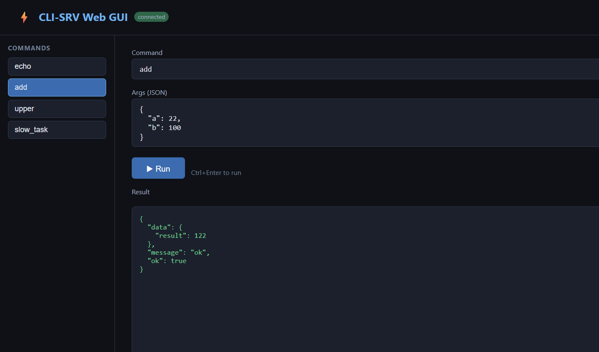

# cpp_cli_srv

A minimal C++ framework that exposes **the same business logic** through two surfaces simultaneously:

- **CLI** — for humans at a terminal, agents via pipe/subprocess, or shell scripts
- **HTTP Server** — for browser GUI or any REST client

Write a command **once** in `core/commands.h`. Both the CLI binary and the web server pick it up automatically.



---

## Table of Contents

1. [Project Structure](#project-structure)
2. [Quick Start](#quick-start)
3. [CLI Usage](#cli-usage)
4. [Server Usage](#server-usage)
5. [Global JSON Variable](#global-json-variable)
6. [HTTP API](#http-api)
7. [Browser GUI](#browser-gui)
8. [Performance](#performance)
9. [Running Tests](#running-tests)
10. [Concurrency Model](#concurrency-model)
11. [Adding a New Command](#adding-a-new-command)
12. [Built-in Commands](#built-in-commands)
13. [Platform Differences](#platform-differences)
14. [Architecture](#architecture)
15. [Known Limitations](#known-limitations)
16. [Documentation](#documentation)
17. [Author & License](#author--license)

---

## Project Structure

```
cpp_cli_srv/
├── core/
│   ├── engine.h          ← Engine class: register/dispatch/schema (thread-safe)
│   └── commands.h        ← ALL commands live here. Edit this file only.
├── cli/
│   └── main.cpp          ← CLI shell (argument parsing, JSON I/O)
├── server/
│   └── main.cpp          ← HTTP server shell (REST API + static GUI)
├── web/
│   └── index.html        ← Browser GUI (auto-populated from /get/schema)
├── doc/                  ← Detailed documentation
├── third_party/
│   ├── json.hpp          ← nlohmann/json (header-only)
│   └── httplib.h         ← cpp-httplib (header-only)
├── build/                ← Output directory (binaries + web copy)
├── CMakeLists.txt        ← CMake configuration (Linux build)
├── build.bat / build.sh  ← One-command build scripts
└── test_*.bat / test_*.sh ← Test scripts
```

---

## Quick Start

| Platform | Build Command | Binaries |
|----------|--------------|----------|
| **Linux** | `./build.sh` | `build/cpp_cli`, `build/cpp_srv` |
| **Linux (portable)** | `./build.sh --static` | Statically linked |
| **Windows** | `build.bat` | `build\cpp_cli.exe`, `build\cpp_srv.exe` |
| **Windows (portable)** | `build.bat --static` | Static C++ runtime (`/MT`) |

Then run:
```bash
./build/cpp_srv                      # Start server on port 8080
./build/cpp_cli --schema             # List all commands
```

**Detailed build guides:**
- [Linux build](doc/linux-build.md)
- [Windows build](doc/windows-build.md)
- [Static / portable builds](doc/static-build.md)
- [HTTPS setup](doc/https-setup.md)

---

## CLI Usage

### Command Format

**Recommended (curl-style):**
```bash
./build/cpp_cli -d '{"cmd":"<command>","args":{...}}'
./build/cpp_cli --data '{"cmd":"<command>","args":{...}}'
```

**Legacy (backward-compatible):**
```bash
./build/cpp_cli --cmd <command> --args '{...}'
```

### Common CLI Flags

| Flag | Description |
|------|-------------|
| `--help` | Show help |
| `--schema` | List all commands |
| `-d / --data` | Run command (JSON body) |
| `--human` | Human-readable output (`[OK] result`) |
| `-v / --version` | Show build version |

### Examples

```bash
# Basic
./build/cpp_cli -d '{"cmd":"echo","args":{"text":"hello"}}'
./build/cpp_cli -d '{"cmd":"add","args":{"a":3,"b":4}}'
./build/cpp_cli -d '{"cmd":"add","args":{"a":3,"b":4}}' --human

# Global JSON (token required)
./build/cpp_cli -d '{"cmd":"get_global_json","args":{"token":"jd"}}'
./build/cpp_cli -d '{"cmd":"patch_global_json","args":{"price":99,"token":"jd"}}'

# Shell commands (no token required in CLI)
./build/cpp_cli -d '{"cmd":"call_shell","args":{"command":"ls -la"}}'
```

### Output Format

```json
{"code":0,"output":"result","error":""}
```

With `--human`: `[OK] result`
Exit code: `0` on success, `1` on error — pipeline-safe.

---

## Server Usage

### Starting the Server

```bash
./build/cpp_srv --help
./build/cpp_srv                                    # Default: port 8080
./build/cpp_srv --port 9090                        # Custom port
./build/cpp_srv --port 8080 --threads 8            # Custom thread count
./build/cpp_srv --log server.log                   # Enable file logging
./build/cpp_srv --token mytoken123                 # Set auth token
./build/cpp_srv --no-ipv6                          # IPv4 only
./build/cpp_srv --port_https 8443 --ssl ./ssl      # Enable HTTPS (Linux only)
./build/cpp_srv -v                                 # Show version
```

> **Security:** `--token` enables authentication for `call_shell` and global JSON write commands. Use a strong random token (`openssl rand -hex 16`). Keep it secret. See [security.md](doc/security.md).

> **HTTPS:** Requires OpenSSL dev libs on Linux. See [https-setup.md](doc/https-setup.md).

> **Logging:** See [logging.md](doc/logging.md) for log format and rotation.

### Startup Output

```
=== cpp_srv started ===
  IPv4 (HTTP)  : http://0.0.0.0:8080
  IPv6 (HTTP)  : http://[::]:8080
  Threads : 20 per server
  Schema  : GET  /get/schema
  Status  : GET  /get/status
  Run     : POST /post/run
  GUI     : GET  /
  Press Ctrl+C to stop.
```

---

## Global JSON Variable

A **persistent JSON object** (`data/GLOBAL_JSON.json`) accessible from both server and CLI.

### Server Behavior
- Loads from disk on startup; keeps in memory
- **Deferred writes**: batches edits, writes after 15-min idle or max 20 min
- **Graceful shutdown**: SIGINT/SIGTERM flush pending changes before exit
- Thread-safe concurrent access

### CLI Behavior
- Loads from disk on each invocation; writes immediately after modification

### Access via Commands (all write commands require token)

```bash
# Get entire JSON
curl -X POST http://localhost:8080/post/run \
  -H 'Content-Type: application/json' \
  -d '{"cmd":"get_global_json","args":{"token":"mytoken"}}'

# Get value at path
curl -X POST http://localhost:8080/post/run \
  -H 'Content-Type: application/json' \
  -d '{"cmd":"get_global_json","args":{"path":"/user/name","token":"mytoken"}}'

# Apply merge patch (RFC 7386)
curl -X POST http://localhost:8080/post/run \
  -H 'Content-Type: application/json' \
  -d '{"cmd":"patch_global_json","args":{"price":99,"city":null,"token":"mytoken"}}'

# Replace entire JSON
curl -X POST http://localhost:8080/post/run \
  -H 'Content-Type: application/json' \
  -d '{"cmd":"set_global_json","args":{"value":{"name":"Alice"},"token":"mytoken"}}'
```

### Merge Patch Example (RFC 7386)

```
Before: {"name":"Alice","age":30,"city":"SF"}
Patch:  {"age":31,"city":null,"country":"USA"}
After:  {"name":"Alice","age":31,"country":"USA"}
```
`null` values delete the key.

---

## HTTP API

| Endpoint | Method | Auth | Description |
|----------|--------|------|-------------|
| `/get/schema` | GET | No | All commands with arg definitions |
| `/get/version` | GET | No | Build version |
| `/get/status` | GET | No | Server health (active requests, threads) |
| `/post/run` | POST | Token (for some cmds) | Execute any command |
| `/` | GET | No | Web GUI |

See [api-reference.md](doc/api-reference.md) for full details, all curl examples, and error codes.

---

## Browser GUI

Open `http://localhost:8080` — auto-builds the command list from `/get/schema`. Click any command to pre-fill its argument template, then hit **Run**.

**Token handling:** GUI prompts for token on first authenticated command, caches in `localStorage`. Clears and re-prompts on rejection.

**Command enable/disable** (stored at `/cpp_cli_srv_config` in global JSON):
```json
{ "echo": true, "call_shell": true, "set_global_json": false }
```

**Reverse proxy / sub-path:** GUI auto-detects base URL from `window.location.pathname`. Served at `http://host/cpp_cli_srv/` → all API calls use `/cpp_cli_srv/post/run`.

---

## Performance

10,000 sequential requests to `get_global_json` (`node test_req.js`):

| Metric | Value |
|--------|-------|
| Throughput | ~5,800 req/s |
| Median latency | 0 ms |
| Average latency | 0.16 ms |
| P95 / P99 | 1 ms |
| Success rate | 100% |

---

## Running Tests

| Test | Windows | Linux |
|------|---------|-------|
| CLI smoke tests | `test_cli.bat` | `./test_cli.sh` |
| Server API tests | `test_server.bat` | `./test_server.sh` |
| Shell tests | `test_shell.bat` | `./test_shell.sh` |
| Token auth tests | `test_token.bat` | `./test_token.sh` |
| JSON I/O tests | `test_json.bat` | `./test_json.sh` |
| Global JSON tests | `test_global_json.bat` | `./test_global_json.sh` |
| Concurrency tests | `test_concurrent.bat` | `./test_comprehensive.sh` |
| IPv6 tests | `test_ipv6.bat` | *(included in test_server.sh)* |
| Logging tests | — | `./test_logging.sh` |

Start the server in one terminal, then run the test script in another. `test_server.sh` auto-detects the server port from the running process.

---

## Concurrency Model

```
HTTP Request
     │
     ▼
┌─────────────────────────────────┐
│  httplib::ThreadPool            │  N threads (default = hw_concurrency)
└──────────────┬──────────────────┘
               │ Engine::run()
               │  shared_lock (concurrent-safe read)
               │  handler called OUTSIDE lock
               ▼
    ┌─────────────────┐    ┌──────────────────────────┐
    │  SyncHandler    │    │  AsyncHandler             │
    │  (fast cmds)    │    │  std::async(launch::async)│
    │  runs inline    │    │  dedicated thread, waits  │
    │  zero overhead  │    │  with per-request timeout │
    └─────────────────┘    └──────────────────────────┘
```

- Shared (read) lock during dispatch — concurrent requests never block each other
- Async handlers run on dedicated threads — slow I/O never stalls the pool
- Per-request `timeout_ms` (pass in POST body, default 30 000 ms)

---

## Adding a New Command

**Only edit `core/commands.h`.** No other file changes needed.

### Sync command

```cpp
e.reg(
    { "greet", "Return a greeting",
      { {"name","person's name",true}, {"lang","language code",false,"en"} }
    },
    [](const json& args) -> Result {
        std::string name = args.value("name", "world");
        std::string lang = args.value("lang", "en");
        return { true, "ok", { {"result", (lang=="zh" ? "你好 " : "Hello, ") + name} } };
    }
);
```

### Async command (slow / IO-bound)

```cpp
e.reg_async(
    { "fetch_data", "Fetch something slow", { {"id","record id",true} }, true },
    [](const json& args) -> std::future<Result> {
        int id = args.value("id", 0);
        return std::async(std::launch::async, [id]() -> Result {
            std::this_thread::sleep_for(std::chrono::seconds(2));
            return { true, "ok", { {"result", id * 2} } };
        });
    }
);
```

Then rebuild. The new command is immediately available in both CLI and Web GUI.

---

## Built-in Commands

### Standard

| Command | Type | Auth | Description |
|---------|------|------|-------------|
| `echo` | Sync | No | Return text as-is |
| `add` | Sync | No | Add two numbers (`a`, `b`) |
| `upper` | Sync | No | Convert text to uppercase |
| `slow_task` | Async | No | Simulate slow operation (`ms` param) |

### File I/O

| Command | Auth | Description |
|---------|------|-------------|
| `write_json` | No | Write JSON to file (`path`, `json_content`) |
| `read_json` | No | Read JSON from file (`path`) |

### Shell

| Command | Auth | Description |
|---------|------|-------------|
| `call_shell` | Token | Execute shell command. Windows: `cmd.exe /c`. Linux: bash. |

⚠️ `call_shell` executes arbitrary shell commands. Always use a strong token and restrict network access.

### Global JSON

| Command | Auth | Description |
|---------|------|-------------|
| `get_global_json` | Token | Get entire JSON or value at `path` |
| `set_global_json` | Token | Replace entire global JSON (`value` param) |
| `patch_global_json` | Token | Apply RFC 7386 merge patch (remaining args = patch) |
| `persist_global_json` | No | Force save global JSON to disk immediately |

---

## Platform Differences

| Aspect | Windows | Linux |
|--------|---------|-------|
| Binary names | `cpp_cli.exe`, `cpp_srv.exe` | `cpp_cli`, `cpp_srv` |
| Compiler | MSVC `cl.exe` (`/std:c++17 /O2`) | g++ (`-std=c++17 -O2`) |
| Build system | Direct `cl.exe` via batch | CMake + make |
| System libs | ws2_32.lib (Winsock) | pthread (auto-linked) |
| Scripts | `.bat` | `.sh` |
| Shell quoting | `\"` in cmd.exe | Single quotes `'...'` |
| HTTPS support | Not yet | With OpenSSL |

---

## Architecture

```
                    ┌──────────────────────────────┐
                    │  core/commands.h              │
                    │  register_all(Engine& e)      │
                    │  ← ONLY file you edit ←       │
                    └────────────┬─────────────────┘
                                 │  shared Engine (thread-safe)
              ┌──────────────────┴──────────────────┐
              │                                      │
     ┌────────▼────────┐                   ┌────────▼──────────┐
     │  cli/main.cpp   │                   │  server/main.cpp   │
     │  --cmd  --args  │                   │  POST /post/run    │
     │  --schema       │                   │  GET  /get/schema  │
     │  --human        │                   │  GET  /get/status  │
     └─────────────────┘                   │  GET  /            │
          stdout JSON                      └────────┬──────────┘
          exit 0/1                                  │ HTTP/HTTPS
                                           ┌────────▼────────┐
                                           │  web/index.html  │
                                           │  Browser GUI     │
                                           └─────────────────┘
```

---

## Known Limitations

- **No network auth layer**: server binds to `0.0.0.0`. Use firewall or reverse proxy for production.
- **CORS open**: `Access-Control-Allow-Origin: *`. Restrict via reverse proxy in production.
- **Async timeout non-cancelling**: HTTP response returns immediately on timeout; background thread continues until natural completion.
- **No non-ASCII in C++ source files** (except `web/index.html`). MSVC with codepage 936 errors on non-ASCII in `.cpp`/`.h`.
- **Server must run from `build/`** — reads `web/index.html` via relative path.

---

## Documentation

| Document | Description |
|----------|-------------|
| [doc/api-reference.md](doc/api-reference.md) | Full HTTP API: endpoints, curl examples, error codes |
| [doc/linux-build.md](doc/linux-build.md) | Linux / Ubuntu: build, deploy, test, systemd |
| [doc/windows-build.md](doc/windows-build.md) | Windows: build, deploy, test, troubleshooting |
| [doc/static-build.md](doc/static-build.md) | Portable static binaries (Linux + Windows) |
| [doc/https-setup.md](doc/https-setup.md) | HTTPS / SSL: certificates, Let's Encrypt, production |
| [doc/logging.md](doc/logging.md) | Log format, monitoring, rotation |
| [doc/security.md](doc/security.md) | Token auth, threat model, permission fixes |

---

## Author & License

**Author**: linqi
**Email**: tlqtangok@126.com
**Copyright**: 2026

Released as open source software. All rights reserved.
